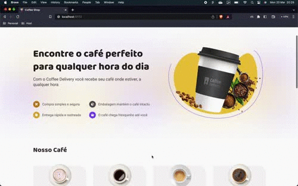

# Coffee Delivery

[](https://github.com/rwellingtonr/coffee-delivery-ignite/blob/master/LICENSE.md)   



## Motivação

Desenvolver um exercício de fixação e aprimoramento dos conhecimentos de front-end desktop com React.

Exercício proposto durante o curso Ignite da RocketSeat 🚀

## Funcionamento

gif...

## Tecnologias

- Immer
- React
- React-router-dom@6
- React-hook-forms
- Styled-components
- TypeScript
- Vite
- Zod

---

## Pattern

- Context-API
- Redux

---

## Rodar local

```bash
# Clone o repositório
git clone https://github.com/rwellingtonr/coffee-delivery-ignite.git

# Entre na pasta
cd coffee-delivery-ignite
# Instale as dependências
npm i

# Rode em modo de desenvolvimento
npm run dev
```

## Melhorias

[ ] Testar fluxo completo
